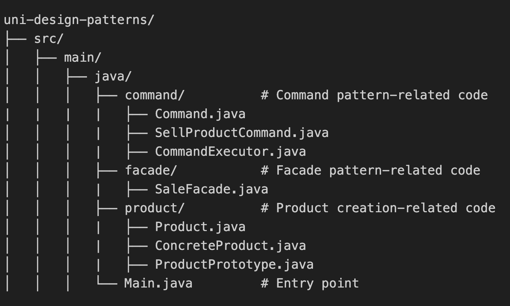

# Project Overview

This project implements a Java console program designed as a supermarket management system. The main functionality includes inventory management and product sales.
- Link: https://github.com/lu7ue/uni-design-patterns

## Team Members
- Luyue Zhang: Part 1
- Anan Li: Part 2


## File Structure



# Part 1: Inventory Management

This functionality manages product creation and inventory updates.

## Applied Design Patterns

### 1. Factory Method (Creational)
The Factory Method pattern is used to encapsulate the creation logic for different types of products (e.g., fruits, vegetables, beverages). This promotes code reusability and flexibility, as new product types can be added without altering existing code. By relying on a factory, the system maintains a single responsibility for product creation, adhering to the Open/Closed Principle.

### 2. Decorator (Structural)
The Decorator pattern allows dynamic addition of features to products, such as marking them as imported or discounted. Each decorator wraps a product instance and adds its specific behavior. Multiple decorators can be chained to combine features. This flexibility allows for dynamic composition of products, enhancing the system's adaptability to changing requirements.

### 3. Observer (Behavioral)
The Observer pattern facilitates the notification mechanism when inventory changes occur, such as when new products are added. This ensures separation of concerns, as inventory management and notification logic are decoupled, making the system easier to maintain and extend.

## Implementation

### 1. Product and Factory (Creation)

- src/main/java/product/Product.java <br> This abstract class serves as the foundation for the Factory Method pattern by defining a common interface for all product types.
```
public abstract class Product {
    protected String name;

    public Product(String name) {
        this.name = name;
    }

    public abstract void store();

    public String getName() {
        return name;
    }
}
```

- src/main/java/product/Fruit.java <br> Implements a concrete product class (Fruit) by providing a specific implementation extending the base Product.
```
public class Fruit extends Product {
    public Fruit(String name) {
        super(name);
    }

    @Override
    public void store() {
        System.out.println(name + " has been added to the inventory (Fruit).");
    }
}
```

- src/main/java/product/ProductFactory.java <br> This class encapsulates the creation logic for products by defining a common interface for all factories.
```
public abstract class ProductFactory {
    public abstract Product createProduct(String name);
}

```

- src/main/java/product/FruitFactory.java <br> Encapsulating the creation logic specific to 'Fruit' objects

```
public class FruitFactory extends ProductFactory {
    @Override
    public Product createProduct(String name) {
        return new Fruit(name);
    }
}

```

### 2. Decorator (Dynamic Features)

- src/main/java/product/ProductDecorator.java <br> This abstract class supports the Decorator pattern by acting as a base for dynamically adding features to products at runtime, ensuring flexibility and adhering to the Open/Closed Principle.

```
public abstract class ProductDecorator extends Product {
    protected Product decoratedProduct;

    public ProductDecorator(Product product) {
        super(product.name);
        this.decoratedProduct = product;
    }
}

```

- src/main/java/product/ImportedProduct.java <br> This class exemplifies the Decorator pattern by adding the 'imported' functionality dynamically, enhancing the original product without altering its structure.
```
public class ImportedProduct extends ProductDecorator {
    public ImportedProduct(Product product) {
        super(product);
    }

    @Override
    public void store() {
        decoratedProduct.store();
        System.out.println(name + " is an imported product.");
    }
}

```
- src/main/java/product/DiscountedProduct.java <br> Implements a decorator for discounted products.

```
public class DiscountedProduct extends ProductDecorator {
    public DiscountedProduct(Product product) {
        super(product);
    }

    @Override
    public void store() {
        decoratedProduct.store();
        System.out.println(name + " is on sale.");
    }
}

```

### 3. Observer (Inventory Notifications)

- src/main/java/observer/Observer.java <br> This interface supports the Observer pattern by defining the contract for receiving notifications, ensuring that observers implement a standardized method for updates.
```
public interface Observer {
    void update(String message);
}

```

- src/main/java/observer/Admin.java <br> The Admin class listens for notifications from a subject and responds to updates.

```
public class Admin implements Observer {
    private String name;

    public Admin(String name) {
        this.name = name;
    }

    @Override
    public void update(String message) {
        System.out.println("Administrator " + name + " received message: " + message);
    }
}

```

- src/main/java/inventory/Inventory.java <br> Implemented notification system in Inventory class can maintain list of observers, notifies all observers when inventory changes, and allows dynamic addition/removal of observers

``` 
public class Inventory {
    private List<Observer> observers = new ArrayList<>();

    public void addObserver(Observer observer) {
        observers.add(observer);
    }

    public void notifyObservers(String message) {
        for (Observer observer : observers) {
            observer.update(message);
        }
    }

    public void addProduct(Product product) {
        System.out.println(product.getName() + " is adding to the inventory.");
        notifyObservers(product.getName() + " has been added to the inventory.");
    }
}
```

# Part 2: Product Sales and Shipping

This functionality enables product sales and shipping management.

## Applied Design Patterns

### 1. Prototype (Creational)
The Prototype pattern is used to clone existing product instances to quickly generate multiple identical products. This is particularly useful in scenarios where the cost of creating a product from scratch is high or where identical instances need to share the same base configuration.

### 2. Facade (Structural)
The Facade pattern simplifies the complex process of product sales by providing a unified interface to manage order creation, invoice generation, and logistics. This reduces dependencies between components.

### 3. Command (Behavioral)
The Command pattern encapsulates the logic for selling products into individual command objects. This allows for batch processing, undo functionality, and flexible execution of commands. It also promotes separation of concerns by decoupling the client code from the logic of the operations.

## Implementation

### 1. Prototype (Cloning Products)

- src/main/java/product/ProductPrototype.java <br> Defines the prototype interface.

```
public interface ProductPrototype {
    ProductPrototype cloneProduct();
}
```

- src/main/java/product/ConcreteProduct.java <br> Implements the product cloning functionality.

```
public class ConcreteProduct extends Product implements ProductPrototype {
    public ConcreteProduct(String name) {
        super(name);
    }

    @Override
    public void store() {
        System.out.println(name + " has been added to the inventory.");
    }

    @Override
    public ProductPrototype cloneProduct() {
        return new ConcreteProduct(this.name);
    }
}
```

### 2. Facade (Simplified Sales Process)

- src/main/java/facade/SaleFacade.java <br> Encapsulates the main steps of the sales process, such as order creation, printing the invoice, and arranging shipping. Provided simple methods for common sales operations
```
public class SaleFacade {
    public void sellProduct(Product product) {
        System.out.println("Selling product: " + product.getName());
        generateInvoice(product);
        arrangeShipping(product);
    }

    private void generateInvoice(Product product) {
        System.out.println("Generating invoice: Product " + product.getName() + " is sold.");
    }

    private void arrangeShipping(Product product) {
        System.out.println("Arranging shipping: Product " + product.getName() + " is shipped.");
    }
}
```


### 3. Command (Encapsulating Operations)

- src/main/java/command/Command.java <br> Defines a unified interface for commands.

```
public interface Command {
    void execute();
}
```

- src/main/java/command/SellProductCommand.java <br> Implements the command for selling products.

```
public class SellProductCommand implements Command {
    private Product product;
    private SaleFacade saleFacade;

    public SellProductCommand(Product product) {
        this.product = product;
        this.saleFacade = new SaleFacade();
    }

    @Override
    public void execute() {
        saleFacade.sellProduct(product);
    }
}
```

- src/main/java/command/CommandExecutor.java <br> Manages and executes multiple commands for batch sales.

```
public class CommandExecutor {
    private List<Command> commandQueue = new ArrayList<>();

    public void addCommand(Command command) {
        commandQueue.add(command);
    }

    public void executeCommands() {
        for (Command command : commandQueue) {
            command.execute();
        }
        commandQueue.clear();
    }
}

```

## Design Pattern Interactions

- Factory Method creates products that can be decorated using the Decorator pattern
- Observer pattern monitors products created by the Factory Method
- Facade uses Command pattern to execute sales operations
- Prototype pattern supports efficient product creation for bulk sales
