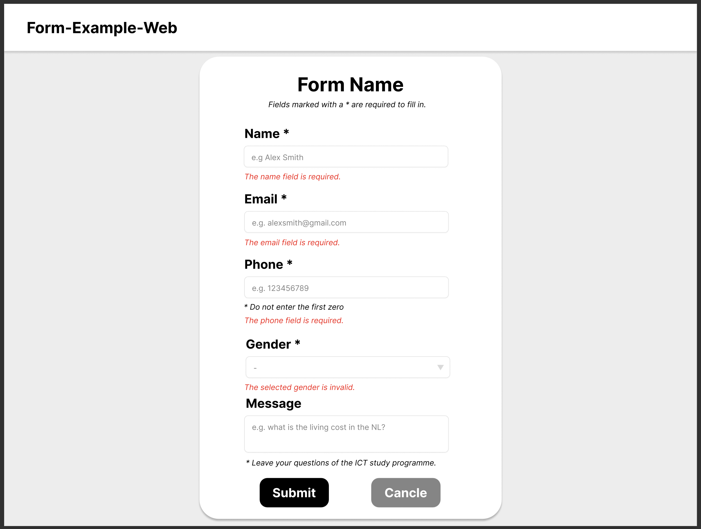

# Form Example Usability

## Overview

This project is a school assignment focused on usability. It is developed using PHP with the Laravel framework and styled with Bulma CSS. The main functionality of the project is to allow users to fill out a form, providing real-time feedback on missing content and specific error messages for incorrect input formats like phone numbers or email addresses.

## Features

### Form Validation

- **Real-Time Feedback**: Users are alerted immediately if they attempt to submit the form without filling in required fields.
- **Specific Error Messages**: Detailed messages are provided for incorrect input formats (e.g., invalid phone numbers or email addresses).

### Error Pages

- **404 Page**: Displayed when the user navigates to an incorrect URL.
- **500 Page**: Displayed when there is an internal server error.

## Design Sketches

Included in this project are design sketches for:

- **404 and 500 Pages**: Wireframes and workflows for these error pages, including instructions on how to return to the home page.
- **Form Error Messages**: Designs showing how error messages should be displayed on the form.

## Installation

1. Clone the repository:
   ```bash
   git clone <repository_url>
   ```
2. Navigate to the project directory:
   ```bash
   cd <project_directory>
   ```
3. Install dependencies:
   ```bash
   composer install
   npm install
   ```
4. Set up the environment file:
   ```bash
   cp .env.example .env
   php artisan key:generate
   ```
5. Configure your database in the `.env` file.
6. Run database migrations:
   ```bash
   php artisan migrate
   ```
7. Serve the application:
   ```bash
   php artisan serve
   ```

## Usage

1. Access the application in your web browser at `http://localhost:8000`.
2. Fill out the form, and observe the real-time feedback for missing fields and incorrect formats.
3. Navigate to a non-existent URL to see the 404 error page.
4. Simulate a server error to see the 500 error page.

## Design Sketches





## License

This project is licensed under the MIT License.
